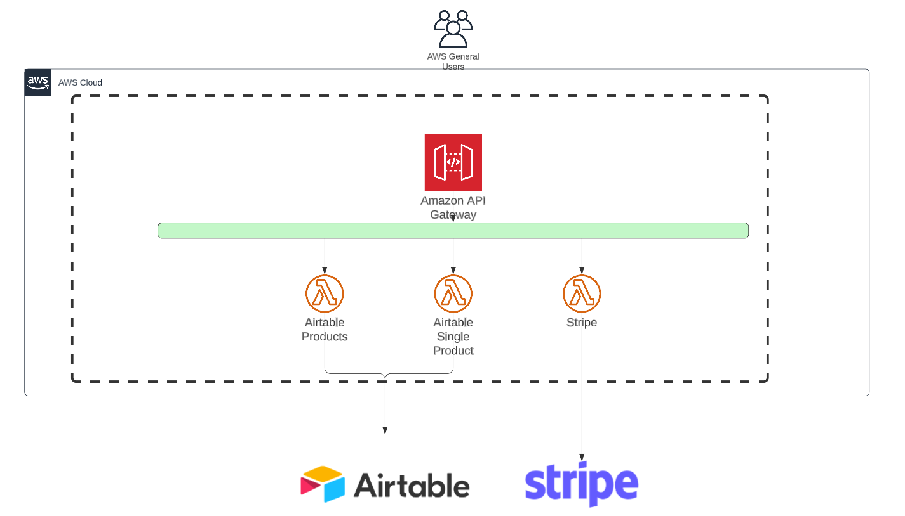
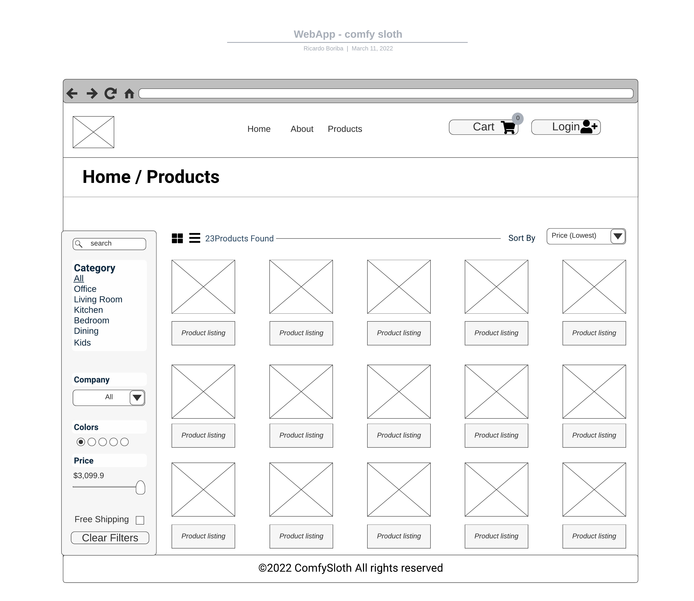
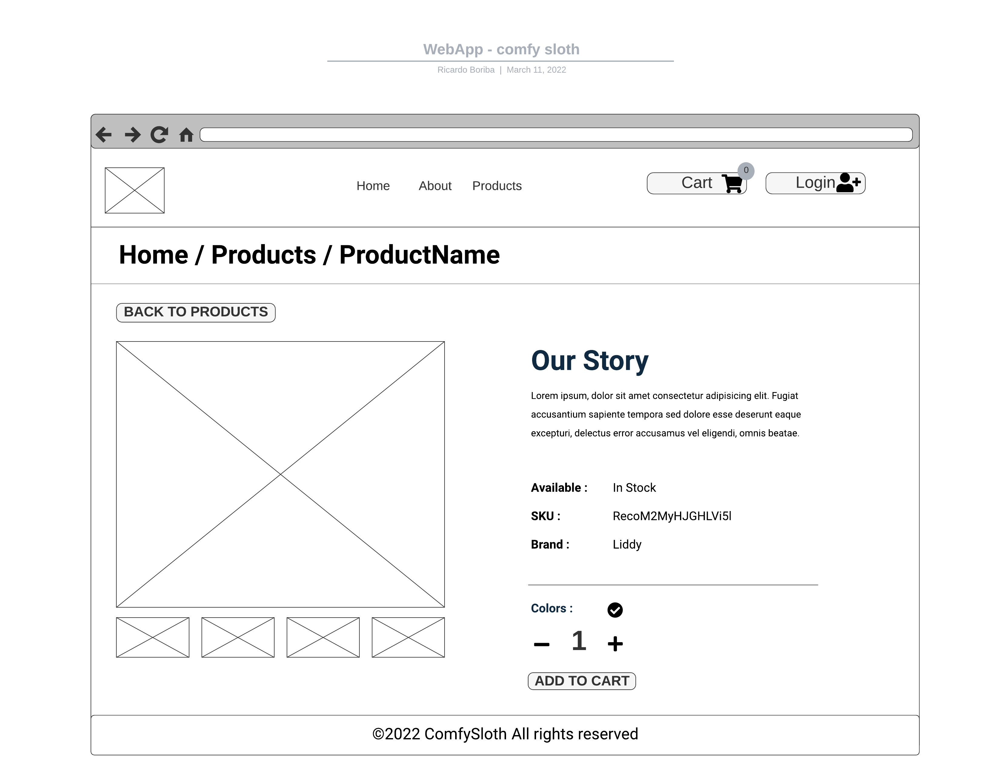
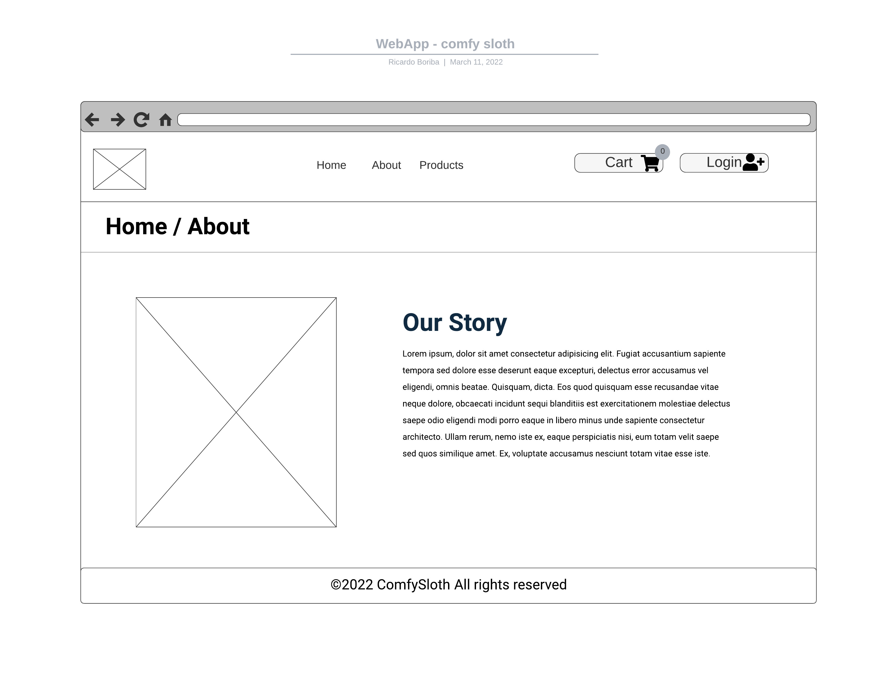
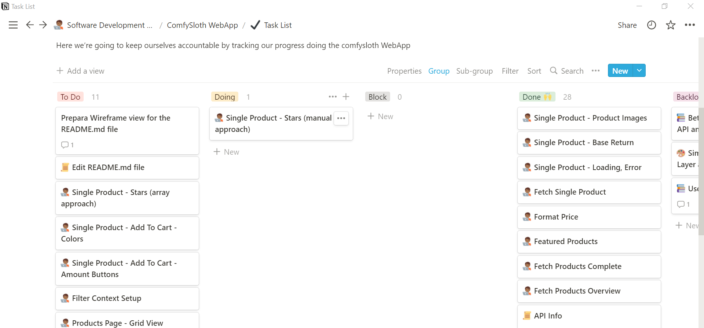

# ComfySloth Reactjs Store App

<p align="center">
  
</p>

## Description

This is an extensive e-commerce application developed using a collection of serverless and AWS services. The application leverages AWS Lambda, S3, Cloudfront, and CI/CD pipeline. It integrates a payment gateway using Stripe and AWS Lambda. Product data is stored in Airtable, which acts as the backend database.

The application is built using React.js, and it features user authentication (Auth0) where users can sign up, log in, log out, view items, add them to the cart, and finally checkout (Stripe). It is deployed in an S3 bucket as a serverless web app and is integrated with AWS Cloudfront for content delivery.

It is organized with a clean and clear folder structure, and it includes various features like a landing page, sign-up and login pages, product viewing, cart functionality, and secure checkout. Each feature has been split into individual React components for easy maintainability and scalability.

Included in this repository, you'll find AWS Lambda functions used for Stripe and for calls to Airtable Products. Components like addToCart, amountButtons, carContent, cartButtons, cartColumns, cartItem, cartTotals, contact, error, featuredProducts, filters, gridView, hero, listView, loading, navbar, pageHero, product, productImage, productList, services, sidebar, sort, stars, stripeCheckout, and more are carefully organized and documented for clarity and ease of use.

Please refer to individual component folders for specific functionality, structure, and implementation details.

Get Acces to the Store [here](d1zhh0zrxyj2ke.cloudfront.net).

No need to register if you don't want to, Just use this credentials:
User: demo_user@gmail.com
Password: Password_12345

## User Stories

- **Sign up**
  ​
- **Login**
  ​
- **Logout**

- **View and Buy Items**

- **Add To Cart**

- **Check Out**

## Backlog

- Deployment to S3 as a serverless web App.
- Integrate with aws cloudfront.
- API Payment Gateway with Stripe and AWS Lambda.
- CI/CD Pipeline for the Frontend Application.
- Airtable as a Backend for add fetch and adding new Products.

# Client / Frontend

## React Router Routes (React App)

| Path          | Component/Pages  | Permissions             | Behavior                                                     |
| ------------- | ---------------- | ----------------------- | ------------------------------------------------------------ |
| `/`           | Landing Page     | public`Route>`          | Home page                                                    |
| `/signup`     | Sign up Page     | public`Route>`          |                                                              |
| `/login`      | Login Page       | public`Route>`          | Login form, link to signup, navigate to homepage after login |
| /about        | About Page       | public`Route>`          |                                                              |
| /products     | Products Page    | public`Route>`          |                                                              |
| /products/:id | Product Detail   | public`Route>`          |                                                              |
| /cart         | Client Cart Page | public`Route>`          |                                                              |
| /checkout     | Checkout Page    | private`<PrivateRoute>` |                                                              |

​

## Components

- addToCart
- amountButtons
- carContent
- cartButtons
- cartColumns
- cartItem
- cartTotals
- contact
- error
- featuredProducts
- filters
- gridView
- hero
- listView
- loading
- navbar
- pageHero
- product
- productImage
- productList
- services
- sidebar
- sort
- stars
- stripeCheckout

## Page Components

- aboutPage
- authWrapper
- cartPage
- checkoutPage
- errorPage
- homePage
- productsPage
- singleProductPage

## Folder structure

```
.
|-- README.md
|-- buildspec.yaml
|-- lambda-functions
|   |-- README.md
|   |-- products-function.zip
|   |-- single-product-function.zip
|   `-- stripe-function.zip
|-- package-lock.json
|-- package.json
|-- public
|   |-- WebAppComfySloth.pdf
|   |-- _redirects
|   |-- about-page.jpeg
|   |-- ezgif-4-c681ecd364.gif
|   |-- favicon.ico
|   |-- home-page.jpeg
|   |-- index.html
|   |-- logo192.png
|   |-- logo512.png
|   |-- manifest.json
|   |-- notion.PNG
|   |-- products-page.jpeg
|   |-- robots.txt
|   `-- single-product-page.jpeg
`-- src
    |-- App.js
    |-- actions.js
    |-- assets
    |   |-- extra-products
    |   |   |-- extra-product-1.jpeg
    |   |   |-- extra-product-2.jpeg
    |   |   |-- extra-product-3.jpeg
    |   |   `-- extra-product-4.jpeg
    |   |-- hero-bcg-2.jpeg
    |   |-- hero-bcg.jpeg
    |   |-- logo.svg
    |   `-- products
    |       |-- product-1.jpeg
    |       |-- product-10.jpeg
    |       |-- product-11.jpeg
    |       |-- product-12.jpeg
    |       |-- product-13.jpeg
    |       |-- product-14.jpeg
    |       |-- product-15.jpeg
    |       |-- product-16.jpeg
    |       |-- product-17.jpeg
    |       |-- product-18.jpeg
    |       |-- product-19.jpeg
    |       |-- product-2.jpeg
    |       |-- product-20.jpeg
    |       |-- product-21.jpeg
    |       |-- product-22.jpeg
    |       |-- product-3.jpeg
    |       |-- product-4.jpeg
    |       |-- product-5.jpeg
    |       |-- product-6.jpeg
    |       |-- product-7.jpeg
    |       |-- product-8.jpeg
    |       `-- product-9.jpeg
    |-- components
    |   |-- addToCart
    |   |   |-- AddToCart.js
    |   |   `-- addToCart-style.js
    |   |-- amountButtons
    |   |   |-- AmountButtons.js
    |   |   `-- amountButtons-style.js
    |   |-- carContent
    |   |   |-- CarContent.js
    |   |   `-- carContent-style.js
    |   |-- cartButtons
    |   |   |-- CartButtons.js
    |   |   `-- cartButtons-style.js
    |   |-- cartColumns
    |   |   |-- CartColumns.js
    |   |   `-- cartColumns-style.js
    |   |-- cartItem
    |   |   |-- CartItem.js
    |   |   `-- cartItem-style.js
    |   |-- cartTotals
    |   |   |-- CartTotals.js
    |   |   `-- cartTotals-style.js
    |   |-- contact
    |   |   |-- Contact.js
    |   |   `-- contact-style.js
    |   |-- error
    |   |   `-- Error.js
    |   |-- featuredProducts
    |   |   |-- FeaturedProducts.js
    |   |   `-- featuredProducts-style.js
    |   |-- filters
    |   |   |-- Filters.js
    |   |   `-- filters-style.js
    |   |-- footer
    |   |   |-- Footer.js
    |   |   `-- footer-style.js
    |   |-- gridView
    |   |   |-- GridView.js
    |   |   `-- gridView-style.js
    |   |-- hero
    |   |   |-- Hero.js
    |   |   `-- hero-style.js
    |   |-- index.js
    |   |-- layouts
    |   |   `-- PrivateLayout.jsx
    |   |-- listView
    |   |   |-- ListView.js
    |   |   `-- listView-style.js
    |   |-- loading
    |   |   `-- Loading.js
    |   |-- navbar
    |   |   |-- Navbar-style.js
    |   |   `-- Navbar.js
    |   |-- pageHero
    |   |   |-- PageHero.js
    |   |   `-- pageHero-style.js
    |   |-- product
    |   |   |-- Product.js
    |   |   `-- product-style.js
    |   |-- productImages
    |   |   |-- ProductImages-style.js
    |   |   `-- ProductImages.js
    |   |-- productList
    |   |   |-- ProductList.js
    |   |   `-- productList-style.js
    |   |-- services
    |   |   |-- Services.js
    |   |   `-- services-style.js
    |   |-- sidebar
    |   |   |-- Sidebar.js
    |   |   `-- sidebar-style.js
    |   |-- sort
    |   |   |-- Sort.js
    |   |   `-- sort-style.js
    |   |-- stars
    |   |   |-- Stars.js
    |   |   `-- stars-style.js
    |   `-- stripeCheckout
    |       |-- StripeCheckout.js
    |       `-- stripeCheckout-style.js
    |-- context
    |   |-- cart_context.js
    |   |-- filter_context.js
    |   |-- products_context.js
    |   `-- user_context.js
    |-- index.css
    |-- index.js
    |-- pages
    |   |-- PrivateRoute.js
    |   |-- aboutPage
    |   |   |-- AboutPage.js
    |   |   `-- aboutPage-style.js
    |   |-- authWrapper
    |   |   |-- AuthWrapper.js
    |   |   `-- authWrapper-style.js
    |   |-- cartPage
    |   |   |-- CartPage.js
    |   |   `-- cartPage-style.js
    |   |-- checkoutPage
    |   |   |-- CheckoutPage.js
    |   |   `-- checkoutPage-style.js
    |   |-- errorPage
    |   |   |-- ErrorPage.js
    |   |   `-- errorPage-style.js
    |   |-- homePage
    |   |   |-- HomePage.js
    |   |   `-- homePage-style.js
    |   |-- index.js
    |   |-- productsPage
    |   |   |-- ProductsPage.js
    |   |   `-- productsPage-style.js
    |   `-- singleProductPage
    |       |-- SingleProductPage.js
    |       `-- singleProductPage-style.js
    |-- reducers
    |   |-- cart_reducer.js
    |   |-- filter_reducer.js
    |   `-- products_reducer.js
    `-- utils
        |-- constants.js
        `-- helpers.js

46 directories, 134 files
```

# Server / Backend

Using Artible, AWS Lambda functions and AWS API Gateway

<p align="center">
  
</p>

## Wireframes

###### Home Page

<p align="center">
  
</p>

###### Products Page

<p align="center">
  
</p>

###### Product Page

<p align="center">
  
</p>

###### About Page

<p align="center">
  
</p>

[Wirefame in PDF](./public/WebAppComfySloth.pdf)

[Lucidchart Link](https://lucid.app/lucidchart/63c396d8-429e-43c2-96d3-3aaf7e3f78fa/edit?invitationId=inv_3de81357-160a-40b4-9ffe-addfb3a3c2ba)

### Notion

[Task organization](https://www.notion.so/d198c02bc7894d558c27d7edb4044845?v=e02f9810e1fa425e8158acc67b1d99c2)

<p align="center">
  
</p>

## How to run it in local

After cloning the repo, install the dependencies using npm install. Start the application with npm start. Make sure to setup environment variables as per the .env_example (should be .env).

In the folder with the name of lambda-functions you will find instructions of how to deploy the lambda function I use to deploy the application
